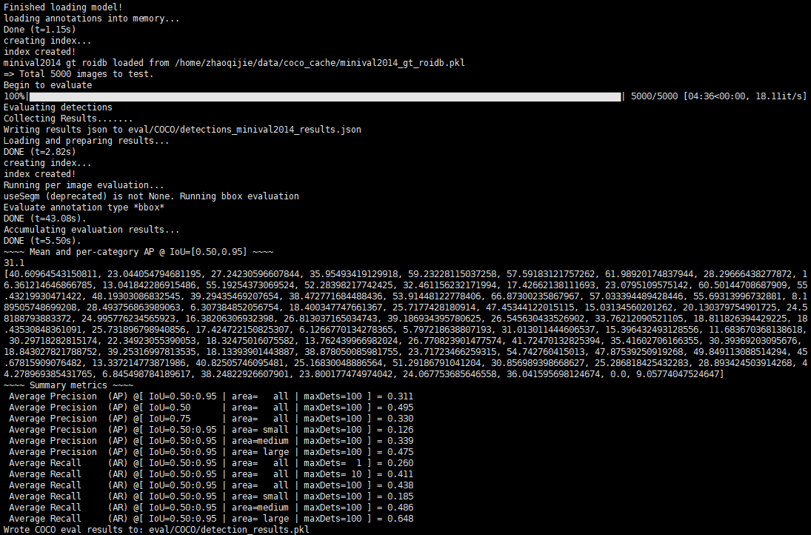

#### CFENet: Object Detection with Comprehensive Feature Enhancement Module

--------

This is a repo for CFENet, ACCV2018.

##### Records:

- 1st on ***UA-DETRAC***

- 6th on ***KITTI car detection***

- 2nd on ***WAD workshop***

- 1st on ***Visdrone object detection in videos***

- 5th on ***Wider Face for face detection***
- ***AP of 43.5 on COCO***

##### Note that CFENet is only an efficient one-stage detector, which can achieve 23+fps on MS-COCO when single-scale inference(VGG-CFENet800).

--------

#### We are still updating this repo 
- [x] the framework for training,evaluation and testing
- [x] CFENet300, CFENet512 for vgg16-reduced and seresnet50
- [ ] Multi-scale inference
- [ ] CFENet800
- [ ] the upgraded CFENet

Detection Comparison on MS-COCO test-dev for **~300x300** input size.

Method | Backbone | Inputsize | AP | AP50 | AP75 |AP-small|AP-medium|AP-large
---|---|---|---|---|---|---|---|---
SSD|VGG-16|300x300|25.1|43.1|25.8|6.6|25.9|41.4
DSSD | ResNet-101|321x321|28.0|46.1|29.2|7.4|28.1|47.6
RetinaNet | ResNet-101|400x400|31.9|49.5|34.1|11.6|35.8|49.5
RefineDet | VGG-16| 320x320|29.4|49.2|31.3|10.0|32.0|44.4
RefineDet | ResNet-101|320x320|32.0|51.4|34.2|10.5|34.7|50.4
RFBBNet| VGG-16|300x300|30.3|49.3|31.8|11.8|31.9|45.9
CFENet | VGG-16|300x300|31.4|50.9|33.2|**12.8**|33.2|46.7
CFENet | SEResNet-50|300x300

Results of other inputsize (To be added)
Method | Backbone | Inputsize | AP | AP50 | AP75 |AP-small|AP-medium|AP-large
---|---|---|---|---|---|---|---|---
CFENet | VGG-16 |512x512|
CFENet |SEResNet-50| 512x512|
CFENet | VGG-16 |800x800|
CFENet | Others(any volunteer？)|


### Contents
1. [Installation and prepare dataset](#installation)
2. [Evaluation](#evaluation)
3. [Training](#training)
4. [Costum dataset](#costum)


## Installation and Prepare Dataset
**the supported version is python3+, pytorch-0.4.1**
- Prepare python environment using [Anaconda3](https://www.anaconda.com/download/).
- Install deeplearning framework, i.e., pytorch, torchvision and other libs.

```Shell
conda install pytorch torchvision -c pytorch
pip install opencv-python,tqdm
```
- Clone this repository.
```Shell
git clone https://github.com/qijiezhao/CFENet.git
```
- Compile the nms and coco tools:

```Shell
sh make.sh
```

- Prepare dataset (e.g., VOC, COCO), refer to [sss.pytorch](https://github.com/amdegroot/ssd.pytorch) for detailed instructions.

## Evaluation 
- First download the pretrained [CFENet300-vgg16](https://pan.baidu.com/s/1CxIAbZox-FvcClrKEgO1lA), and move it to path: ./weights/, and then evaluate it on MS-COCO minival:
```Shell
CUDA_VISIBLE_DEVICES=0 python test.py --config configs/cfenet300_vgg16.py -d COCO -m=weights/cfenet300_vgg16_coco.pth
```
It will display like this: (evaluated on MS-COCO 2014minival)



- ##### You can tune score threshold in configs/cfenet300_vgg16.py for better accuracy.
```Shell
test_cfg = dict(
    cuda = True,
    topk = 0,
    iou = 0.45,
    soft_nms = True,
    score_threshold = 0.01,
    keep_per_class = 50,
    save_folder = 'eval'
    )

```
- ##### If you want to evaluate detection results of CFENet300 on test-dev set, you just modify a line in test.py:
```Shell
#line 143
getattr(cfg.dataset, args.dataset)['test_sets'],

```
- then, submit the detection results at path:
```Shell
·/eval/COCO/detection_results.pkl
```
to the [CODALAB webpage](https://competitions.codalab.org/competitions/5181#participate)

## Training

All training configurations are stored in the variable ***train_cfg*** at the path configs/*.
- First, download the pretrained [VGG-16-reduced model](https://pan.baidu.com/s/1PqzTrfilA-V4Bjb7yRA1Cg)
##### we suggest to train CFENet on a machine with 4 Titan-XP GPUs at least. (2 GPUs is OK for inputsize 300x300, but too slow for 512x512)

train script:

```Shell
CUDA_VISIBLE_DEVICES=0,1,2,3 python train.py --config configs/cfenet300_vgg.py -d COCO --ngpu 4
```

## Costum dataset usage
### To be added


-----

##### The code is mainly based on [rfbnet](https://github.com/ruinmessi/RFBNet) and [pytorch-ssd](https://github.com/qijiezhao/pytorch-ssd), thanks for their contribution!

##### Please email me: zhaoqijie@pku.edu.cn or open issues if any bugs exist.
